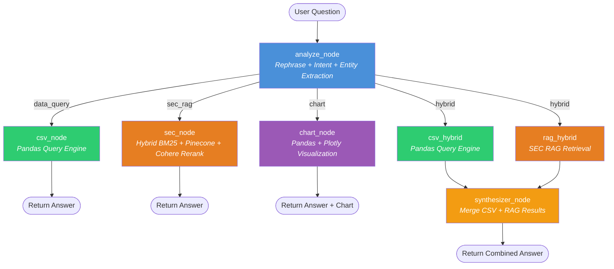

# 📈 FinSight — Agentic Financial Research Assistant

An AI-powered financial research system that combines **structured financial data** (CSV) with **unstructured SEC 10-K filings** (PDF) using an agentic RAG pipeline built on LangGraph.

---

## Architecture Overview

```
┌──────────────┐        ┌──────────────┐         ┌──────────────────────┐
│  Streamlit   │  SSE   │   FastAPI    │  async  │      LangGraph       │
│     UI       │◄──────►│   Backend    │◄───────►│    Agent Workflow    │
│  (app.py)    │        │  (api.py)    │         │   (src/graph/)       │
└──────────────┘        └──────────────┘         └──────────────────────┘
```

---

## Graph Workflow Diagram



### Node Descriptions

| Node | Purpose | Key Operations |
|------|---------|----------------|
| **analyze_node** | Intent classification + entity extraction | Single LLM call → JSON with intent, companies, years, metrics, statement_type |
| **csv_node** | Query structured financial data | Schema retrieval → LLM generates pandas expr + answer template → eval → format |
| **sec_node** | Retrieve SEC 10-K filing context | BM25 keyword search + Pinecone semantic search → RRF fusion → Cohere rerank → LLM answer |
| **chart_node** | Generate interactive charts | Schema retrieval → LLM generates chart spec → Pandas eval → Plotly figure |
| **synthesizer_node** | Combine CSV + RAG answers | Merges structured data insights with 10-K narrative into a unified response |

---

## Data Coverage

| Type | Companies | Fiscal Years |
|------|-----------|--------------|
| Income Statement (CSV) | Apple, Google, Microsoft, Nvidia | 2021 – 2025 |
| Balance Sheet (CSV) | Apple, Google, Microsoft, Nvidia | 2021 – 2025 |
| Cash Flow Statement (CSV) | Apple, Google, Microsoft, Nvidia | 2021 – 2025 |
| SEC 10-K Filings (PDF) | Apple, Google, Microsoft, NVIDIA | 2023, 2024, 2025 |

---

## Intent Routing

| Intent | Trigger Examples | Pipeline |
|--------|-----------------|----------|
| `csv_query` | "What was Nvidia's revenue in 2024?" | analyze → csv_node → answer |
| `sec_rag` | "What are Google's risk factors?" | analyze → sec_node → answer |
| `chart` | "Plot a bar chart of revenue" | analyze → chart_node → answer + chart |
| `hybrid` | "Compare revenue figures with 10-K commentary" | analyze → csv + sec (parallel) → synthesizer |

---

## Tech Stack

| Component | Technology |
|-----------|-----------|
| LLM | OpenAI GPT-4o-mini |
| Embeddings | text-embedding-3-small (1536-dim) |
| Vector DB | Pinecone |
| Keyword Search | BM25Okapi (rank-bm25) |
| Reranker | Cohere rerank-english-v3.0 |
| Orchestration | LangGraph (StateGraph) |
| Backend | FastAPI + SSE streaming |
| Frontend | Streamlit |
| Charts | Plotly Express |
| Data Processing | Pandas |

---

## Setup

### 1. Clone and create virtual environment

```bash
git clone https://github.com/your-repo/FinSight-Agentic-RAG.git
cd FinSight-Agentic-RAG

python -m venv myenv
myenv\Scripts\activate        # Windows
source myenv/bin/activate     # macOS/Linux

pip install -r requirements.txt
```

### 2. Configure environment variables

Create a `.env` file in the project root:

```env
OPENAI_API_KEY=sk-...
PINECONE_API_KEY=...
PINECONE_ENVIRONMENT=us-east-1
COHERE_API_KEY=...

# Optional: LangSmith tracing
LANGCHAIN_TRACING_V2=true
LANGCHAIN_API_KEY=ls__...
LANGCHAIN_PROJECT=FinSight-AI
```

### 3. Ingest data (one-time)

```bash
# Ingest SEC 10-K PDFs into Pinecone + BM25 corpus
python ingestion.py

# Ingest column metadata for schema retrieval
python ingest_metadata.py
```

### 4. Start the backend

```bash
uvicorn api:app --reload --port 8000
```

API docs available at: http://localhost:8000/docs

### 5. Start the Streamlit UI

```bash
streamlit run app.py
```

App available at: http://localhost:8501

---

## Project Structure

```
FinSight-Agentic-RAG/
├── api.py                  # FastAPI backend (SSE streaming + REST)
├── app.py                  # Streamlit chat UI
├── config.py               # Central configuration
├── ingestion.py            # SEC PDF → Pinecone + BM25 pipeline
├── ingest_metadata.py      # Column schema → Pinecone metadata namespace
├── src/
│   ├── graph/
│   │   └── graph.py        # LangGraph workflow (StateGraph assembly)
│   ├── nodes/
│   │   └── nodes.py        # All LangGraph nodes (analyze, csv, sec, chart, synthesizer)
│   ├── prompts/
│   │   └── prompts.py      # All LLM prompt templates
│   ├── retriever/
│   │   ├── retriever.py    # HybridRetriever (BM25 + Pinecone + Cohere rerank)
│   │   └── schema_retriever.py  # Column schema retriever with caching
│   ├── schemas/
│   │   └── state.py        # FinSightState TypedDict
│   └── utils/
│       └── csv_engine.py   # DataFrame loading + sanitization
├── data/
│   ├── Balance_Sheets/     # Company balance sheet CSVs
│   ├── Income_Statments/   # Company income statement CSVs
│   ├── Cash_Flow_Statments/ # Company cash flow CSVs
│   ├── SEC_Filings/        # 10-K PDF files
│   ├── metadata/           # Column schema JSON files
│   └── bm25_corpus.pkl     # Serialized BM25 corpus (generated)
├── requirements.txt
├── .env                    # API keys (never commit)
└── .gitignore
```

---

## Key Features

- **Agentic routing** — Automatically classifies user intent and routes to the appropriate pipeline
- **Hybrid retrieval** — BM25 keyword + Pinecone semantic + Cohere reranking for SEC filing search
- **Smart chart generation** — LLM designs the chart spec, Pandas computes data, Plotly renders
- **Streaming responses** — Word-by-word SSE streaming with animated thinking indicator
- **Schema-aware queries** — Column metadata retrieval ensures correct pandas expressions
- **Parallel execution** — Hybrid queries run CSV and RAG branches concurrently
- **Follow-up questions** — Asks for clarification when required context (e.g., fiscal year) is missing

---

## Example Questions

```
# Financial metrics (CSV)
"What was Nvidia's revenue in 2024?"
"What was Apple's operating margin in 2024?"
"Compare Google and Microsoft net income for 2023"

# Trends and comparisons
"Show Nvidia's revenue growth over the years"
"Which company has the highest free cash flow margin?"

# Charts
"Plot a bar chart of revenue for all companies in 2024"
"Show a line chart of Apple's EPS from 2021 to 2025"

# SEC 10-K RAG
"What are NVIDIA's key risk factors in its 2025 10-K?"
"What did Microsoft say about AI strategy in 2024?"
"Summarize Google's business segments from the 2023 filing"

# Hybrid
"Compare Nvidia's reported revenue with what they said about data center growth"
```

---

## API Endpoints

| Method | Endpoint | Description |
|--------|----------|-------------|
| POST | `/FinSight/stream` | SSE streaming chat (token-by-token) |
| POST | `/FinSight/chat` | Non-streaming chat (full JSON response) |
| GET | `/FinSight/history/{session_id}` | Retrieve session history |
| DELETE | `/FinSight/history/{session_id}` | Clear session history |

---
